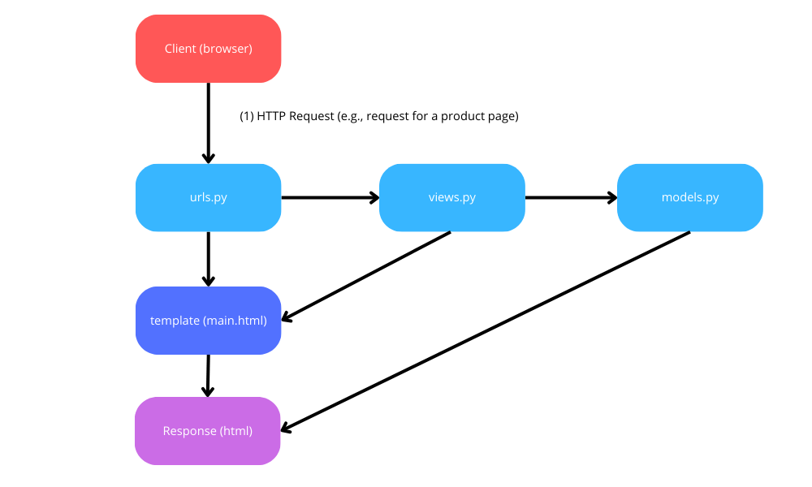
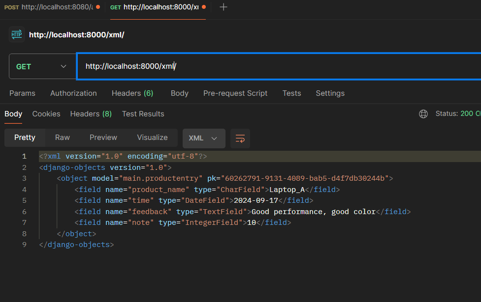
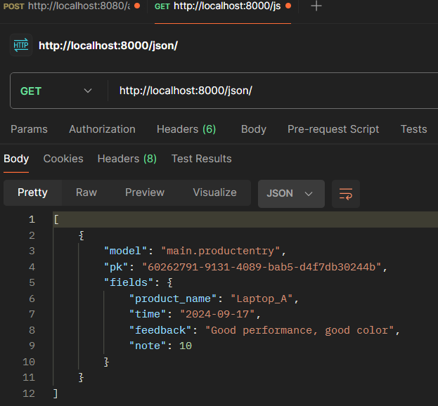
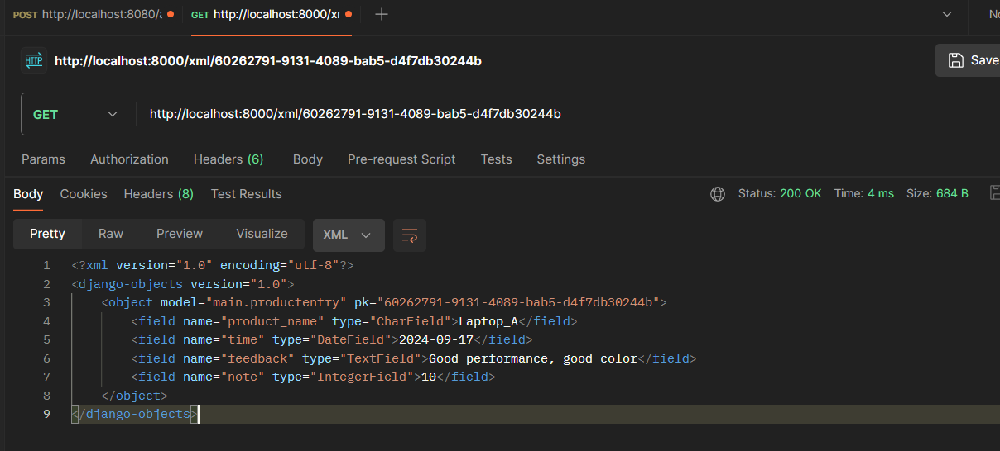
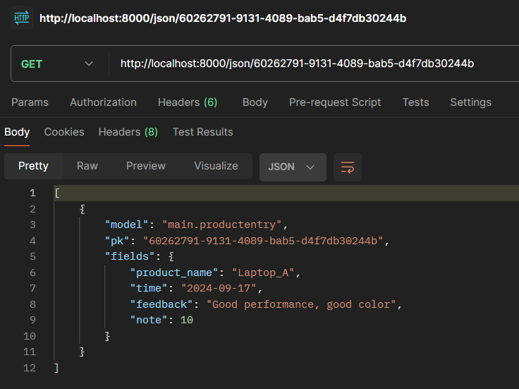

PWS link :

Assignment 2

**Explain how you implemented the checklist above step-by-step (not just following the tutorial):**
My approach to the implementation was to first think about the overall structure of the project and how the different components would fit together. My main goal was to set up the Django project and the "main" app in a way that covered all the requirements. I started by creating the project and app, keeping the required fields—`name`, `price`, and `description`—in mind for the model. I also wanted to make the model more flexible, so I added other fields like `stock` to manage the products better.
For the function in `views.py`, my reasoning was straightforward: I needed to display some basic information in a template. I kept it simple, just showing the required details (app name, my name, and class). This allowed me to focus on making the code clean and functional without adding unnecessary complexity.
When it came to routing, I wanted it to be smooth and easy to follow, so I linked the views and URLs in a logical way. As for deployment, I made sure everything was correctly set up to run online, but the key was making sure the application worked well in production once it was deployed.

**Create a diagram that contains the request client to a Django-based web application and the response it gives, and explain the relationship between urls.py, views.py, models.py, and the html file.**

**Explain the use of git in software development!**
Git is a widely used version control system in software development that helps teams track changes to code, manage collaboration, and maintain multiple versions of a project. It allows developers to work on isolated branches for new features or bug fixes without interfering with the main codebase, enabling parallel development. Changes are tracked as commits, which can be reviewed, reverted, or merged with other code, providing a detailed history of the project. Git also simplifies collaboration by helping to resolve conflicts when multiple developers contribute to the same files.

**In your opinion, out of all the frameworks available, why is Django used as the starting point for learning software development?**
Django is a great starting point for learning software development because it offers a "batteries-included" approach, providing many essential features like an ORM, authentication, and admin interface right out of the box. This allows beginners to focus on learning the core concepts of web development without worrying about setting up basic components. Additionally, Django encourages best practices through its emphasis on clean, maintainable code and has extensive documentation, making it easier for newcomers to follow along. Its scalability and versatility also make it a good framework to use for both small projects and real-world applications.

**Why is the Django model called an ORM?**
Django's model is called an ORM (Object-Relational Mapping) because it allows developers to interact with the database using Python objects instead of writing SQL queries. The ORM maps database tables to Python classes, where each class represents a table and each attribute corresponds to a field in that table. This abstraction simplifies database operations, letting developers create, retrieve, update, and delete records using Python code. The Django ORM automatically handles translating these operations into SQL, making database management easier and more intuitive for developers working in an object-oriented language.

Assignment 3

**Explain why we need data delivery in implementing a platform.**  
Data delivery is essential in implementing a platform because it enables the efficient transfer of data between different components, services, or users. Without reliable data delivery, a platform cannot function smoothly, as users or systems would not be able to send, receive, or process the necessary information to perform their tasks. Proper data delivery ensures synchronization, communication, and overall system functionality.

**In your opinion, which is better, XML or JSON? Why is JSON more popular than XML?**  
JSON is generally considered better than XML for most modern applications due to its simplicity and readability. JSON’s lightweight structure makes it faster to parse and easier for both humans and machines to process, especially in web development. It has become more popular than XML because it integrates well with JavaScript, requires less code, and is easier to manipulate, making it ideal for APIs and data exchange in web environments.

**Explain the functional usage of is_valid() method in Django forms. Also explain why we need the method in forms.**  
The `is_valid()` method in Django forms is used to validate form data against the predefined form fields and their rules. It checks whether all required fields are filled, ensures that data types are correct, and applies any custom validation logic. This method is crucial because it allows developers to ensure that only clean and valid data gets processed or saved, preventing potential errors or malicious inputs in the application.

**Why do we need csrf_token when creating a form in Django? What could happen if we did not use csrf_token on a Django form? How could this be leveraged by an attacker?**  
The `csrf_token` in Django forms protects against Cross-Site Request Forgery (CSRF) attacks by ensuring that the request comes from a trusted source. If a form does not use `csrf_token`, an attacker could exploit this vulnerability by tricking users into unknowingly submitting malicious requests. This could result in unauthorized actions, such as data manipulation or security breaches within the platform.

**Explain how you implemented the checklist above step-by-step (not just following the tutorial).**
I tried first to have the concept of product with the attribute which are going to be in the form
Then I implemented it on the models.py, forms.py and views.py
Finally I add the other functions for apply the good format (JSON/XML) to the data added.

**Postman results (4 screens)**

Assignment 4

**What is a UserCreationForm, explain its advantages and disadvantages?**  
A `UserCreationForm` in Django is a built-in form that simplifies the process of creating a new user by providing predefined fields such as username, password, and password confirmation. Its advantages include ease of use, built-in validation, and security features, allowing developers to quickly implement user registration functionality. However, its disadvantages are limited customization out of the box and it may require additional work if the form needs to be extended for more complex user data or registration workflows.

**What is the difference between authentication and authorization in Django, why are both important?**  
Authentication in Django verifies the identity of a user, ensuring they are who they claim to be, typically through a login process. Authorization, on the other hand, determines what an authenticated user is allowed to do, such as access certain pages or perform specific actions. Both are crucial: authentication ensures that only legitimate users can access the system, while authorization controls their permissions, ensuring security by restricting access to sensitive or privileged parts of the platform.

**What are cookies in web development, and how do Django use cookies to manage user sessions?**  
Cookies in web development are small pieces of data stored on the user's browser that can be used to track, identify, or store information about the user across different requests. In Django, cookies are used to manage user sessions by storing a session ID that corresponds to data on the server, allowing the server to remember user-specific data, such as login status, across multiple requests without requiring the user to re-authenticate on each page load.

**Are the use of cookies safe by default in web development, or are there risks that need to be noted?**  
Cookies are not inherently safe by default and come with certain risks. If not handled properly, cookies can be vulnerable to attacks such as Cross-Site Scripting (XSS) or Cross-Site Request Forgery (CSRF). To mitigate these risks, developers should ensure cookies are marked as secure, especially for sensitive data, and use additional protections like `HttpOnly` and `SameSite` flags to prevent unauthorized access or misuse by attackers.

**Explain how you implemented the checklist above step-by-step (not just following the tutorial).**
I add first the register / login function with the necessity to be logged to access to the main page
Then I test that by creating 2 users (username / password are in main/login.txt)
Moreover I add the use of cookie for keeping in memory the last time of login for a certain user.
At the end, I associate the Product model with the User.
Finally I tested every functionnalities added.

Assignment 5

**Explain the priority order of multiple CSS selectors for an HTML element.**  
In CSS, the priority order of selectors, also known as specificity, determines which styles are applied when multiple rules target the same element. The order of priority is as follows: inline styles (highest specificity), IDs (e.g., #header), classes (e.g., .menu), attributes (e.g., [type="text"]), and elements (e.g., div). The more specific a selector is, the higher its priority. If two selectors have the same specificity, the last one in the CSS file will take precedence. This hierarchy ensures that the intended styles are applied correctly without conflicts.

**Why does responsive design become an important concept in web application development? Give examples of applications that have and have not implemented responsive design.**
Responsive design is crucial in web application development because it ensures that applications are accessible and visually appealing across various devices and screen sizes. As users increasingly access the internet through smartphones and tablets, a responsive design adapts layouts and content to fit any screen, enhancing usability and user experience. Examples of applications with responsive design include Twitter and Airbnb, where the layout changes seamlessly between desktop and mobile views. Conversely, applications like some outdated news sites may lack responsive design, leading to poor usability on mobile devices.

**Explain the differences between margin, border, and padding, and how to implement these three things.**  
Margin, border, and padding are three critical properties in CSS that control spacing and layout around HTML elements. Margin is the outermost space that creates distance between an element and its neighboring elements, effectively pushing them away. Border is a line that wraps around the padding and content of an element, which can be styled in various ways (e.g., solid, dashed). Padding is the inner space between the content and the border, providing breathing room within the element. To implement these properties, you can use CSS syntax like margin: 10px;, border: 1px solid black;, and padding: 15px; to define the desired spacing.

**Explain the concepts of flexbox and grid layout along with their uses.**
Flexbox and Grid are powerful layout models in CSS that provide more control over the design of web pages. Flexbox is designed for one-dimensional layouts, allowing elements within a container to align and distribute space along a single axis (either row or column). It’s useful for creating responsive navigation bars or aligning items in a single line. Grid layout, on the other hand, is a two-dimensional layout system that allows you to design complex layouts by defining rows and columns. It is particularly effective for grid-based designs, such as image galleries or dashboard layouts, where elements need to be placed in specific locations on a grid. Both methods promote responsive design, making it easier to adapt layouts to various screen sizes.

**Explain how you implemented the checklist above step-by-step (not just following the tutorial)!**
For that assignment, I think about the differents function I want to add first like edit and delete function so I create functions for that. After that I make the routing of the function and then I go into appearance of the website. I try to create better interfaces for almost all the pages.

Assignment 6

**Explain the benefits of using JavaScript in developing web applications!**  
JavaScript is essential for developing web applications as it enables interactivity and dynamic content on web pages. It allows developers to create responsive user interfaces that enhance user experience by enabling features like real-time updates, form validations, and animations. Additionally, JavaScript facilitates asynchronous programming through techniques like AJAX, which allows web applications to fetch data without reloading the page. The widespread support of JavaScript across all major browsers and its integration with various libraries and frameworks, such as React and Angular, further enhances its versatility and effectiveness in building modern web applications.

**Explain why we need to use await when we call fetch(). What would happen if we don't use await?**  
The `await` keyword is necessary when calling the `fetch()` function to ensure that the code execution pauses until the Promise returned by `fetch()` resolves, allowing us to handle the response correctly. If we don’t use `await`, the code continues executing without waiting for the fetch operation to complete, which can lead to errors when trying to access the response data. As a result, we may end up attempting to process data that hasn’t been received yet, causing undefined behavior or runtime errors in the application.

**Why do we need to use the csrf_exempt decorator on the view used for AJAX POST?**  
The `csrf_exempt` decorator is used on views handling AJAX POST requests to bypass the Cross-Site Request Forgery (CSRF) protection mechanism provided by frameworks like Django. AJAX requests often require authentication tokens to prevent CSRF attacks, but in cases where the front end does not send these tokens, applying `csrf_exempt` allows the view to process the request without the CSRF check. However, using this decorator should be done with caution, as it may expose the application to security vulnerabilities if not properly handled.

**On this week's tutorial, the user input sanitization is done in the back-end as well. Why can't the sanitization be done just in the front-end?**  
While front-end input sanitization helps improve user experience by providing immediate feedback, it should not be solely relied upon for security. Front-end sanitization can be bypassed by users who disable JavaScript or manipulate the client-side code. Therefore, implementing input sanitization in the back end is crucial for ensuring data integrity and security, as it protects against malicious inputs and potential attacks like SQL injection or XSS (Cross-Site Scripting). A robust security model requires validation and sanitization at both the front end and back end to safeguard the application.

**Explain how you implemented the checklist above step-by-step (not just following the tutorial)**
For this assignment I create a new function for using ajax and then I routed the function to a new page
For that I also add a button to use ajax for creating product from the home page. Moreover I add script for the gestion of product in the homepage. Finally I protect my form from XSS.
